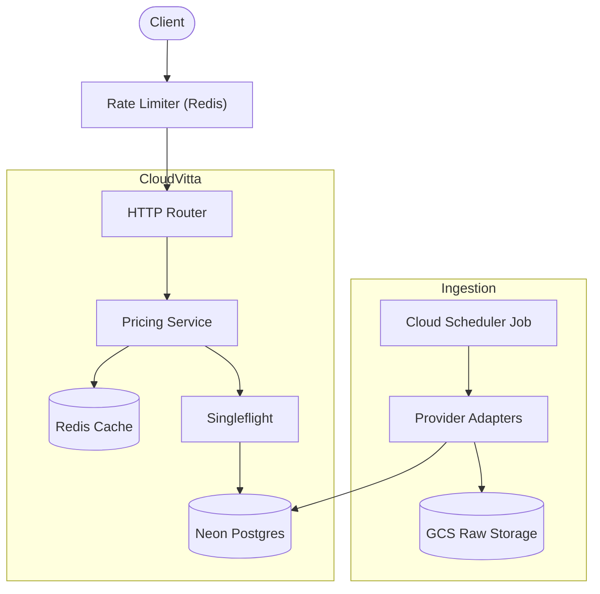

# CloudVitta

## Problem Statement
Comparing cloud costs today means visiting each provider's calculator or pricing page separately and manually reconciling different units, currencies, and pricing models. There is no single tool for an apples-to-apples, live-data comparison across all major providers. CloudVitta solves this by pulling live pricing from official APIs, normalizing disparate models into comparable units, converting to a single currency, and providing a clean API for cross-cloud cost comparisons.

**Live Demo:** `[TODO: Insert Cloud Run URL after Stage 0.8 deploys]`

## Architecture

## Local Run Instructions
1. Copy `.env.example` to `.env` and fill in your local Postgres and Redis credentials.
2. Run database migrations using `tern`: `tern migrate -m migrations -c tern.conf`
3. Start the API server: `go run cmd/api/main.go`
4. The server will be available at `http://localhost:8080`.
5. Access OpenAPI documentation at `http://localhost:8080/docs/`.
