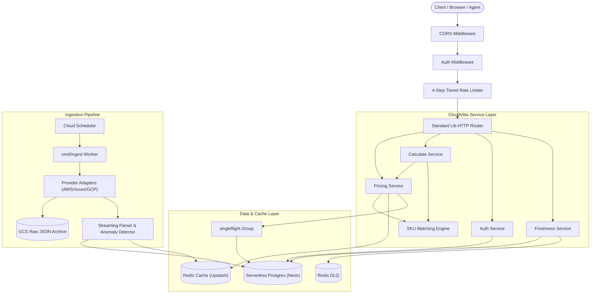

# CloudVitta

## Problem Statement
Comparing cloud costs today requires visiting each provider's calculator or pricing page separately and manually reconciling different units, currencies, and pricing models. There is no single tool for an apples-to-apples, live-data comparison across all major providers. CloudVitta solves this problem by ingesting live pricing from official cloud provider APIs, normalizing disparate pricing models into canonical units, converting currencies, and serving comparisons through a high-performance REST API and Model Context Protocol (MCP) agent tools.

**Live Production API:** [https://cloudvitta-api-pelqqgz3mq-as.a.run.app](https://cloudvitta-api-pelqqgz3mq-as.a.run.app)
* **Compute Comparison**: `GET /api/v1/prices/compute?vcpu=2&ram_gb=8&region=us-east`
* **Storage Comparison**: `GET /api/v1/prices/storage?tier=standard&region=us-east`
* **Network Comparison**: `GET /api/v1/prices/network?transfer_type=internet_egress&region=us-east`
* **Composite Workload Calculation**: `POST /api/v1/calculate`
* **Provider Freshness & Status**: `GET /api/v1/providers/aws/status`
* **Interactive Swagger Documentation**: [https://cloudvitta-api-pelqqgz3mq-as.a.run.app/docs/](https://cloudvitta-api-pelqqgz3mq-as.a.run.app/docs/)
* **Health Check**: [https://cloudvitta-api-pelqqgz3mq-as.a.run.app/healthz](https://cloudvitta-api-pelqqgz3mq-as.a.run.app/healthz)

---

## System Architecture



---

## Architecture & Technical Documentation

| Document | Description |
| :--- | :--- |
| [System Architecture](docs/diagrams/01-system-architecture.md) | High-level system architecture and infrastructure topology |
| [Data Model ERD](docs/diagrams/02-data-model-erd.md) | Entity relationship diagram for price observations, users, refresh tokens, and FX rates |
| [Ingestion Flow Diagram](docs/diagrams/03-ingestion-flow.md) | Ingestion orchestrator lifecycle, rate limiting, GCS raw storage, and event-driven cache warming |
| [Calculator Request Lifecycle](docs/diagrams/04-calculator-request-lifecycle.md) | Single-category cache-miss flow, composite calculation fan-out, and provider status lifecycle |
| [Auth Token Rotation & Theft Containment](docs/diagrams/05-auth-token-rotation.md) | Refresh token family rotation, idempotency replay cache, and theft detection |
| [Package Structure & Dependencies](docs/diagrams/06-package-structure.md) | Modular monolith package hierarchy and dependency rules |
| [Architectural Decision Records (ADRs)](docs/adr/README.md) | Index of 29 architectural decision records with context, trade-offs, and alternatives |
| [Master Development Guide](docs/DEVELOPMENT_GUIDE.md) | Local environment setup, coding conventions, testing guidelines, and quality standards |
| [Production Deployment Guide](docs/devops/01-deployment-guide.md) | Cloud Run service configuration, Google Cloud Secret Manager wiring, and CI/CD pipelines |

---

## Local Development Quickstart

### 1. Prerequisites
- Go 1.22+ installed
- PostgreSQL instance (or Neon connection string)
- Redis instance (or Upstash connection string)
- `tern` migration tool: `go install github.com/jackc/tern/v2@latest`

### 2. Setup Environment
```bash
cp .env.example .env
# Edit .env with your local PostgreSQL and Redis credentials
```

### 3. Run Database Migrations
```bash
tern migrate -m migrations -c tern.conf
```

### 4. Start the Application
```bash
# Start API server (port 8080)
go run cmd/api/main.go

# Run Ingestion worker
go run cmd/ingest/main.go
```

### 5. Run Test Suite
```bash
# Run unit and race detection tests
go test -race ./...

# Run static analysis
go vet ./...
```
