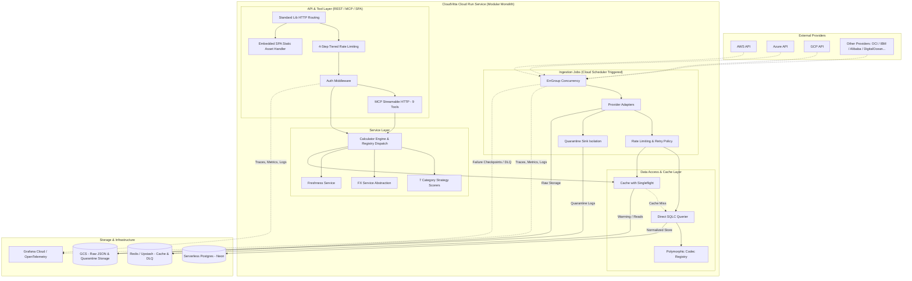

# System Architecture

```mermaid
flowchart TD
    subgraph "External Providers"
        P1[AWS API]
        P2[Azure API]
        P3[GCP API]
        PN[Other Providers: OCI / IBM / Alibaba / DigitalOcean...]
    end

    subgraph "CloudVitta Cloud Run Service (Modular Monolith)"
        direction TB
        
        subgraph "Ingestion Jobs (Cloud Scheduler Triggered)"
            I_WG[ErrGroup Concurrency]
            I_AD[Provider Adapters]
            I_RL[Rate Limiting & Retry Policy]
            I_QS[Quarantine Sink Isolation]
            I_WG --> I_AD
            I_AD --> I_RL
            I_AD --> I_QS
        end

        subgraph "API & Tool Layer (REST / MCP / SPA)"
            API_R[Standard Lib HTTP Routing]
            API_RL[4-Step Tiered Rate Limiting]
            API_Auth[Auth Middleware]
            API_MCP[MCP Streamable HTTP - 9 Tools]
            API_SPA[Embedded SPA Static Asset Handler]
            API_R --> API_RL
            API_R --> API_SPA
            API_RL --> API_Auth
            API_Auth --> API_MCP
        end

        subgraph "Service Layer"
            S_CE[Calculator Engine & Registry Dispatch]
            S_SM[7 Category Strategy Scorers]
            S_FX[FX Service Abstraction]
            S_FS[Freshness Service]
            
            S_CE --> S_SM
            S_CE --> S_FX
            S_CE --> S_FS
        end

        subgraph "Data Access & Cache Layer"
            D_SQLC[Direct SQLC Querier]
            D_Cache[Cache with Singleflight]
            D_Codec[Polymorphic Codec Registry]
        end

        API_Auth --> S_CE
        API_MCP --> S_CE
        I_RL --> D_SQLC
        I_RL --> D_Cache
        S_CE --> D_Cache
        D_Cache -.->|Cache Miss| D_SQLC
        D_SQLC --> D_Codec
    end

    subgraph "Storage & Infrastructure"
        DB[(Serverless Postgres - Neon)]
        Redis[(Redis / Upstash - Cache & DLQ)]
        GCS[(GCS - Raw JSON & Quarantine Storage)]
        OTEL[Grafana Cloud / OpenTelemetry]
    end

    P1 -.-> I_WG
    P2 -.-> I_WG
    P3 -.-> I_WG
    PN -.-> I_WG

    I_AD -->|Raw Storage| GCS
    I_QS -->|Quarantine Logs| GCS
    D_SQLC -->|Normalized Store| DB
    D_Cache -->|Warming / Reads| Redis
    
    %% Telemetry and DLQ
    API_Auth -.->|Traces, Metrics, Logs| OTEL
    I_WG -.->|Traces, Metrics, Logs| OTEL
    I_WG -.->|Failure Checkpoints / DLQ| Redis
```
