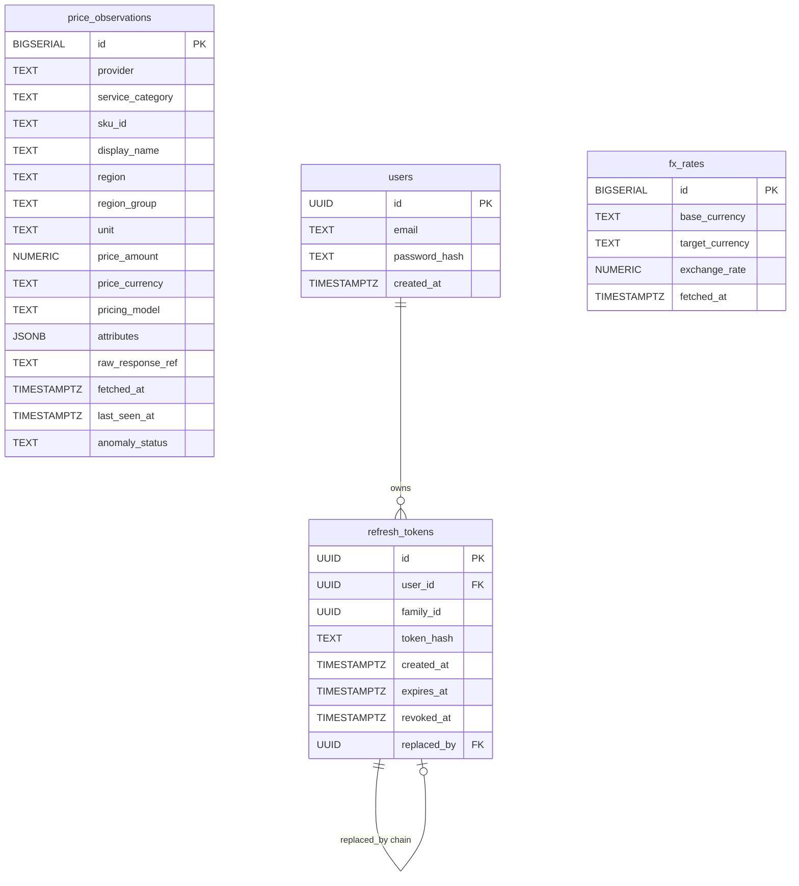
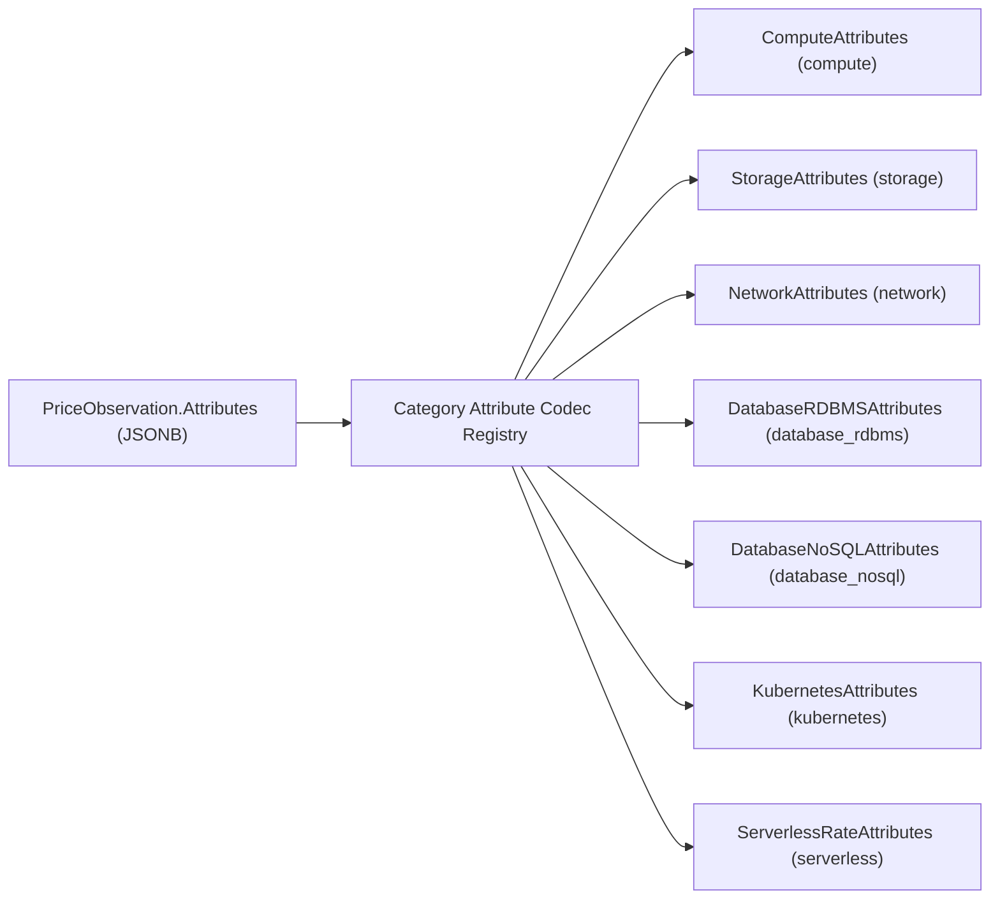

# Data Model (Entity Relationship Diagram)

This document details the PostgreSQL relational schema and polymorphic JSONB attribute representations across all seven service categories.

---

## 1. Entity Relationship Diagram



---

## 2. Polymorphic Attribute Codec Architecture

The `attributes` JSONB column stores category-specific specification vectors. Serialization and deserialization are handled through the extensible `RegisterCategoryAttributeCodec` registry (`internal/domain/price_observation.go` per ADR 0031).



---

## 3. Polymorphic JSONB Schema Definitions

### 1. Compute (`ComputeAttributes`)
```json
{
  "vcpu": 4,
  "ram_gb": 16.0,
  "family": "general_purpose",
  "gpu_count": 0,
  "storage_type": "ebs_only"
}
```

### 2. Storage (`StorageAttributes`)
```json
{
  "storage_class": "standard",
  "min_duration_days": 0,
  "redundancy": "regional"
}
```

### 3. Network (`NetworkAttributes`)
```json
{
  "transfer_type": "internet_egress",
  "tier_min_gb": 0,
  "tier_max_gb": 10000
}
```

### 4. Managed Relational Databases (`DatabaseRDBMSAttributes` - ADR 0030)
- **Instance Component Row (`component_type = "instance"`):**
  ```json
  {
    "component_type": "instance",
    "engine": "postgresql",
    "vcpu": 4,
    "ram_gb": 16.0,
    "multi_az": false,
    "deployment_tier": "general_purpose"
  }
  ```
- **Storage Capacity Row (`component_type = "storage"`):**
  ```json
  {
    "component_type": "storage",
    "engine": "postgresql",
    "storage_family": "gp3",
    "max_iops": 12000,
    "multi_az": false
  }
  ```

### 5. Managed NoSQL Databases (`DatabaseNoSQLAttributes` - ADR 0033)
- **Throughput Component Row (`component_type = "throughput"`):**
  ```json
  {
    "component_type": "throughput",
    "data_model": "document",
    "pricing_mode": "provisioned",
    "operation_type": "read",
    "multi_region": false
  }
  ```
- **Storage Capacity Row (`component_type = "storage"`):**
  ```json
  {
    "component_type": "storage",
    "data_model": "document",
    "pricing_mode": "provisioned",
    "multi_region": false
  }
  ```

### 6. Managed Kubernetes Control-Plane (`KubernetesAttributes` - ADR 0034)
```json
{
  "tier": "standard",
  "cluster_topology": "zonal"
}
```

### 7. Serverless Compute (`ServerlessRateAttributes`)
- **Request Rate Row (`rate_component = "request_fee"`):**
  ```json
  {
    "rate_component": "request_fee",
    "tier": "standard",
    "architecture": "x86_64",
    "billing_unit": "requests",
    "free_tier_allowance": 1000000
  }
  ```
- **Duration Rate Row (`rate_component = "duration_fee"` or split `duration_fee_cpu` / `duration_fee_memory`):**
  ```json
  {
    "rate_component": "duration_fee",
    "tier": "standard",
    "architecture": "x86_64",
    "billing_unit": "gb_seconds",
    "free_tier_allowance": 400000
  }
  ```
