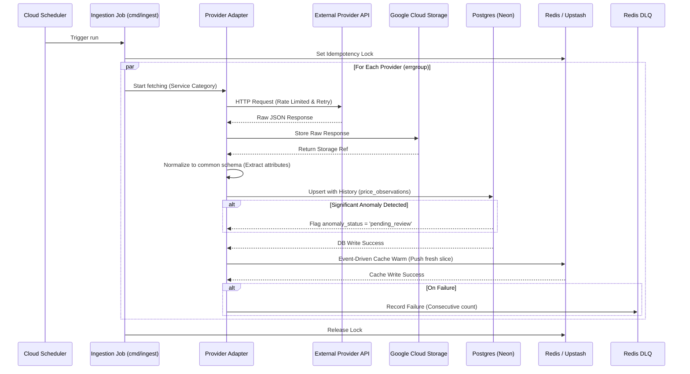

# Ingestion Flow (Event-driven Warming)

```mermaid
sequenceDiagram
    participant Scheduler as Cloud Scheduler
    participant Job as Ingestion Job (cmd/ingest)
    participant Adapter as Provider Adapter
    participant API as External Provider API
    participant GCS as Google Cloud Storage
    participant DB as Postgres (Neon)
    participant Redis as Redis / Upstash
    participant DLQ as Redis DLQ

    Scheduler->>Job: Trigger run
    Job->>Redis: Set Idempotency Lock
    
    par For Each Provider (errgroup)
        Job->>Adapter: Start fetching (Service Category)
        Adapter->>API: HTTP Request (Rate Limited & Retry)
        API-->>Adapter: Raw JSON Response
        Adapter->>GCS: Store Raw Response
        GCS-->>Adapter: Return Storage Ref
        
        Adapter->>Adapter: Normalize to common schema (Extract attributes)
        
        Adapter->>DB: Upsert with History (price_observations)
        alt Significant Anomaly Detected
            DB-->>Adapter: Flag anomaly_status = 'pending_review'
        end
        DB-->>Adapter: DB Write Success
        
        Adapter->>Redis: Event-Driven Cache Warm (Push fresh slice)
        Redis-->>Adapter: Cache Write Success
        
        alt On Failure
            Adapter->>DLQ: Record Failure (Consecutive count)
        end
    end
    
    Job->>Redis: Release Lock
```
