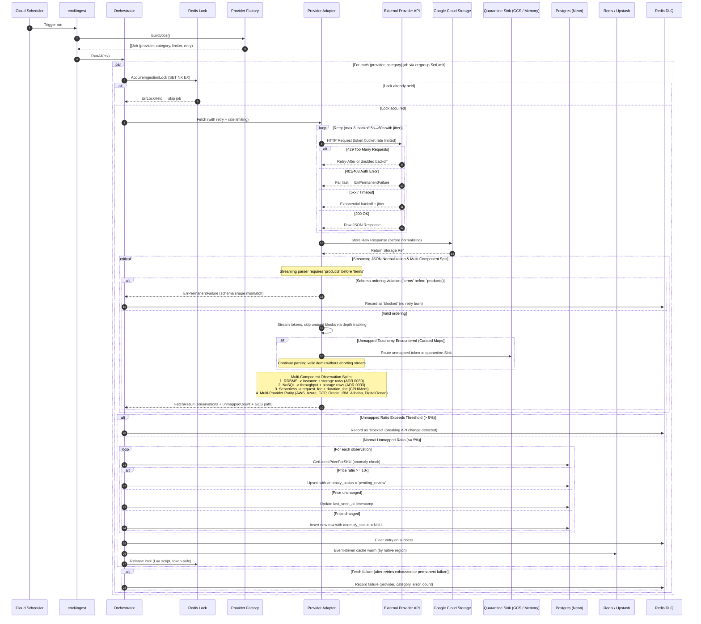

# Ingestion Flow (Orchestrator, Multi-Component Normalization, & Quarantine Sink)



---

## Payload Ordering & Streaming Invariants

To guarantee memory safety in resource-constrained environments (Cloud Run 512MiB memory ceiling), provider bulk pricing parsers stream JSON tokens incrementally rather than buffering whole documents.

- **Ordering Contract:** The AWS EC2 adapter requires `products` to precede `terms`.
- **Failure Classification:** If a payload violates this ordering, parsing terminates immediately with `provider.ErrPermanentFailure`. The orchestrator bypasses retries and writes the incident directly to the Redis DLQ with `status = "blocked"`.
- **Zero-Allocation Skipping:** Non-compute products, unused pricing terms (`Reserved`, `SavingsPlans`), and metadata objects are skipped via depth-tracking token loops (`skipValue`) without allocating memory for the discarded subtrees.

---

## Multi-Component Observation Splitting

To prevent Cartesian explosion in the database, multi-meter services are ingested as distinct component rows in `price_observations` with `service_category` and `attributes.component_type`:

1. **Relational Databases (`database_rdbms` - ADR 0030)**:
   - Compute instances: `component_type = "instance"` (hourly rate).
   - Storage capacity: `component_type = "storage"` (monthly rate per GB, joined at query time).
2. **NoSQL Databases (`database_nosql` - ADR 0033)**:
   - Operational throughput: `component_type = "throughput"` (provisioned RCU/WCU/RU or on-demand operations).
   - Storage capacity: `component_type = "storage"` (monthly rate per GB, joined at query time).
3. **Serverless Compute (`serverless`)**:
   - Request fees: `rate_component = "request_fee"` (rate per 1M requests).
   - Duration fees: `rate_component = "duration_fee"` (rate per GB-second) or split `duration_fee_cpu` and `duration_fee_memory` (GCP).

---

## Runtime Taxonomy Isolation via Quarantine Sink & 3-Way Classification

When provider APIs return raw pricing streams, the normalizer triages records into three distinct classifications:
1. **In-Scope Valid (`ItemClassificationNormalized`)**: Successfully parsed into domain `PriceObservation` records.
2. **In-Scope Unknown (`ItemClassificationQuarantined`)**: In-scope resources with unmapped taxonomy attributes (unknown shape, tier, region, database engine). These records route to `quarantine.Sink` and increment `UnmappedCount`.
3. **Out-of-Scope Discarded (`ItemClassificationIgnored`)**: Unmodeled provider catalog lines (such as network egress under database feeds, non-IaaS enterprise services, and unsupported commitments). These records are excluded from quarantine and increment `IgnoredCount`.

### Threshold Invariant Formula
To prevent out-of-scope catalog noise from skewing the quarantine threshold, the unmapped ratio is computed strictly against in-scope items:
```
in_scope_total = unmapped_count + valid_observations_count
ratio = unmapped_count / in_scope_total
```
- If `ratio > MaxUnmappedRatio` (default 5%), the job fails with `ErrPermanentFailure` and logs a blocked incident to Redis DLQ to alert engineers of breaking upstream API taxonomy changes.
- If `ratio <= MaxUnmappedRatio`, valid observations proceed to database upsert and cache warming.
- Quarantined records are flushed to GCS at `quarantine/<provider>/<category>/<date>/<fetchID>.jsonl` and digested with `cmd/quarantine-digest`.
