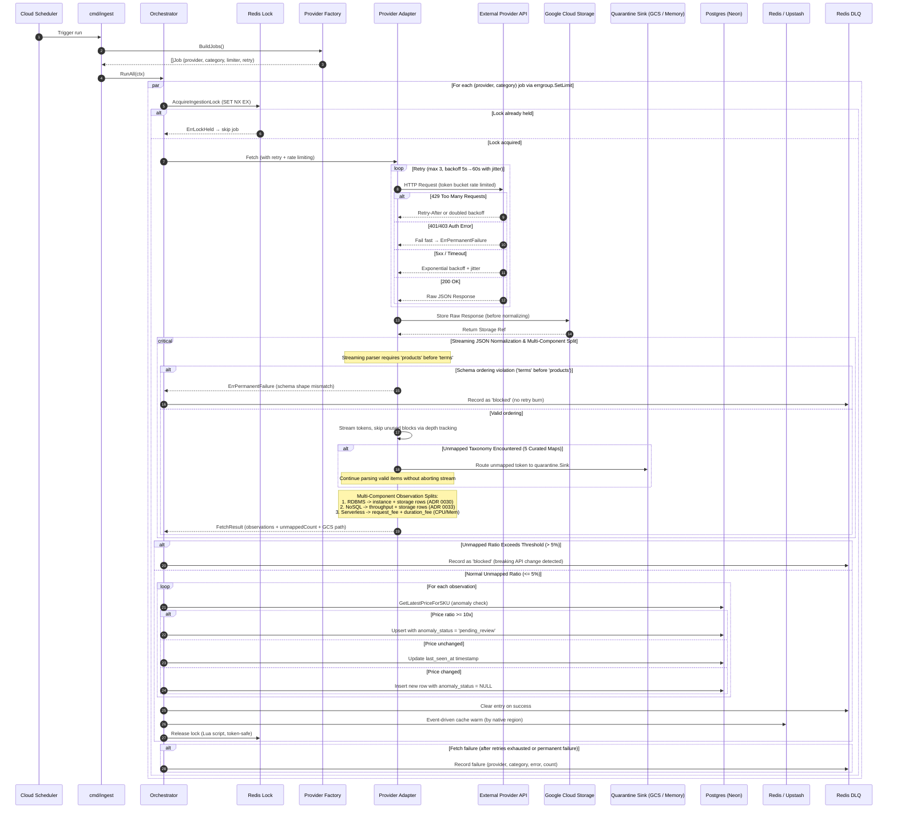

# Ingestion Flow (Orchestrator, Multi-Component Normalization, & Quarantine Sink)

---

## Payload Ordering & Streaming Invariants

To guarantee memory safety in resource-constrained environments (Cloud Run 512MiB memory ceiling), provider bulk pricing parsers stream JSON tokens incrementally rather than buffering whole documents.

- **Ordering Contract:** The AWS EC2 adapter requires `products` to precede `terms`.
- **Failure Classification:** If a payload violates this ordering, parsing terminates immediately with `provider.ErrPermanentFailure`. The orchestrator bypasses retries and writes the incident directly to the Redis DLQ with `status = "blocked"`.
- **Zero-Allocation Skipping:** Non-compute products, unused pricing terms (`Reserved`, `SavingsPlans`), and metadata objects are skipped via depth-tracking token loops (`skipValue`) without allocating memory for the discarded subtrees.

---

## Multi-Component Observation Splitting

To prevent Cartesian explosion in the database, multi-meter services are ingested as distinct component rows in `price_observations` with `service_category` and `attributes.component_type`:

1. **Relational Databases (`database_rdbms` - ADR 0030)**:
   - Compute instances: `component_type = "instance"` (hourly rate).
   - Storage capacity: `component_type = "storage"` (monthly rate per GB, joined at query time).
2. **NoSQL Databases (`database_nosql` - ADR 0033)**:
   - Operational throughput: `component_type = "throughput"` (provisioned RCU/WCU/RU or on-demand operations).
   - Storage capacity: `component_type = "storage"` (monthly rate per GB, joined at query time).
3. **Serverless Compute (`serverless`)**:
   - Request fees: `rate_component = "request_fee"` (rate per 1M requests).
   - Duration fees: `rate_component = "duration_fee"` (rate per GB-second) or split `duration_fee_cpu` and `duration_fee_memory` (GCP).

---

## Runtime Taxonomy Isolation via Quarantine Sink

When provider APIs return new or unrecognized taxonomy values (regions, storage classes, transfer types, database engines, Kubernetes tiers, or serverless units):
1. The normalizer isolates the unmapped record to `quarantine.Sink`.
2. Parsing continues for all valid items in the stream.
3. Quarantined records are flushed to GCS at `quarantine/<provider>/<category>/<date>/<fetchID>.jsonl`.
4. If `unmapped / (unmapped + valid) > MaxUnmappedRatio` (default 5%), the job fails loudly with `ErrPermanentFailure` and logs an incident to Redis DLQ to alert engineering of upstream API breaking changes.
5. Quarantined records can be digested into taxonomy PR code using `cmd/quarantine-digest`.
