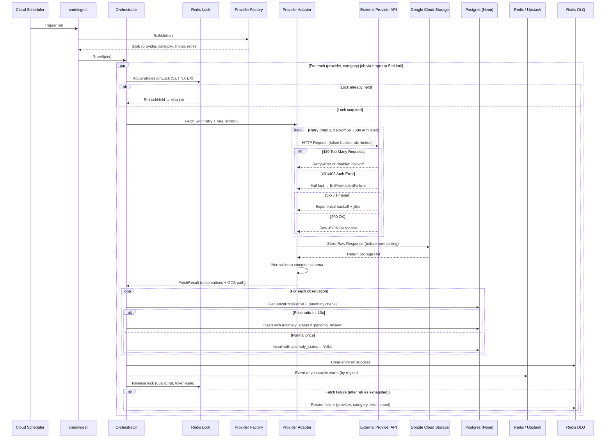

# Ingestion Flow (Orchestrator + Event-driven Warming)

```mermaid
sequenceDiagram
    participant Scheduler as Cloud Scheduler
    participant Main as cmd/ingest
    participant Orch as Orchestrator
    participant Lock as Redis Lock
    participant Factory as Provider Factory
    participant Adapter as Provider Adapter
    participant API as External Provider API
    participant GCS as Google Cloud Storage
    participant DB as Postgres (Neon)
    participant Redis as Redis / Upstash
    participant DLQ as Redis DLQ

    Scheduler->>Main: Trigger run
    Main->>Factory: BuildJobs()
    Factory-->>Main: []Job (provider, category, limiter, retry)
    Main->>Orch: RunAll(ctx)
    
    par For each (provider, category) job via errgroup.SetLimit
        Orch->>Lock: AcquireIngestionLock (SET NX EX)
        alt Lock already held
            Lock-->>Orch: ErrLockHeld → skip job
        else Lock acquired
            Orch->>Adapter: Fetch (with retry + rate limiting)
            
            loop Retry (max 3, backoff 5s→60s with jitter)
                Adapter->>API: HTTP Request (token bucket rate limited)
                alt 429 Too Many Requests
                    API-->>Adapter: Retry-After or doubled backoff
                else 401/403 Auth Error
                    API-->>Adapter: Fail fast → ErrPermanentFailure
                else 5xx / Timeout
                    API-->>Adapter: Exponential backoff + jitter
                else 200 OK
                    API-->>Adapter: Raw JSON Response
                end
            end

            Adapter->>GCS: Store Raw Response (before normalizing)
            GCS-->>Adapter: Return Storage Ref
            
            Adapter->>Adapter: Normalize to common schema
            Adapter-->>Orch: FetchResult (observations + GCS path)
            
            loop For each observation
                Orch->>DB: GetLatestPriceForSKU (anomaly check)
                alt Price ratio >= 10x
                    Orch->>DB: Insert with anomaly_status = 'pending_review'
                else Normal price
                    Orch->>DB: Insert with anomaly_status = NULL
                end
            end
            
            Orch->>DLQ: Clear entry on success
            Orch->>Redis: Event-driven cache warm (by region)
            Orch->>Lock: Release lock (Lua script, token-safe)
            
            alt Fetch failure (after retries exhausted)
                Orch->>DLQ: Record failure (provider, category, error, count)
            end
        end
    end
```
