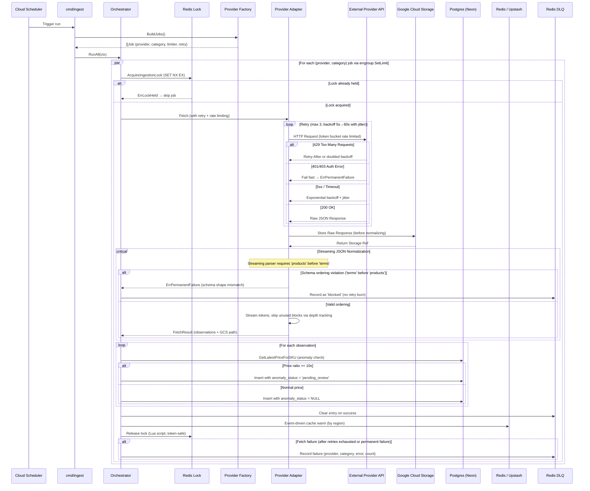

# Ingestion Flow (Orchestrator + Event-driven Warming)

## Payload Ordering & Streaming Invariant
To guarantee memory safety in resource-constrained environments (Cloud Run 512MiB memory ceiling), provider bulk pricing parsers stream JSON tokens incrementally rather than buffering whole documents.

- **Ordering Contract:** The AWS EC2 adapter requires `products` to precede `terms`.
- **Failure Classification:** If a payload violates this ordering, parsing terminates immediately with `provider.ErrPermanentFailure`. The orchestrator bypasses retries and writes the incident directly to the Redis DLQ with `status = "blocked"`.
- **Zero-Allocation Skipping:** Non-compute products, unused pricing terms (`Reserved`, `SavingsPlans`), and metadata objects are skipped via depth-tracking token loops (`skipValue`) without allocating memory for the discarded subtrees.
