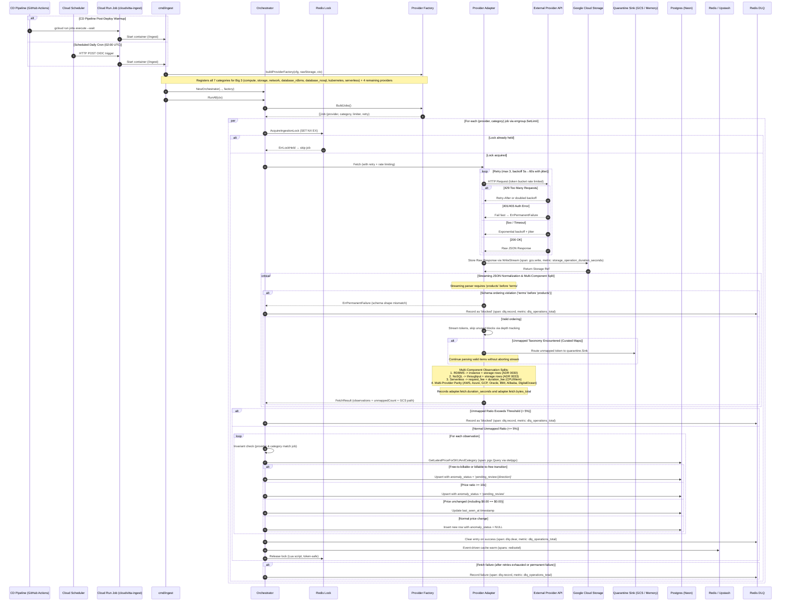

# Ingestion Flow (Orchestrator, Multi-Component Normalization, & Quarantine Sink)



---

## Payload Ordering & Streaming Invariants

To guarantee memory safety in resource-constrained environments (Cloud Run 512MiB memory ceiling), provider bulk pricing parsers stream JSON tokens incrementally rather than buffering whole documents.

- **Ordering Contract:** The AWS EC2 adapter requires `products` to precede `terms`.
- **Failure Classification:** If a payload violates this ordering, parsing terminates immediately with `provider.ErrPermanentFailure`. The orchestrator bypasses retries and writes the incident directly to the Redis DLQ with `status = "blocked"`.
- **Zero-Allocation Skipping:** Non-compute products, unused pricing terms (`Reserved`, `SavingsPlans`), and metadata objects are skipped via depth-tracking token loops (`skipValue`) without allocating memory for the discarded subtrees.

---

## Multi-Component Observation Splitting

To prevent Cartesian explosion in the database, multi-meter services are ingested as distinct component rows in `price_observations` with `service_category` and `attributes.component_type`:

1. **Relational Databases (`database_rdbms` - ADR 0030)**:
   - Compute instances: `component_type = "instance"` (hourly rate).
   - Storage capacity: `component_type = "storage"` (monthly rate per GB, joined at query time).
2. **NoSQL Databases (`database_nosql` - ADR 0033)**:
   - Operational throughput: `component_type = "throughput"` (provisioned RCU/WCU/RU or on-demand operations).
   - Storage capacity: `component_type = "storage"` (monthly rate per GB, joined at query time).
3. **Serverless Compute (`serverless`)**:
   - Request fees: `rate_component = "request_fee"` (rate per 1M requests).
   - Duration fees: `rate_component = "duration_fee"` (rate per GB-second) or split `duration_fee_cpu` and `duration_fee_memory` (GCP).
   - Ingestion Endpoints:
     - AWS: AWS Price List API for AWS Lambda (`DefaultLambdaPriceListURL`).
     - Azure: Azure Retail Prices API for Azure Functions (`DefaultFunctionsRetailPricesURL`).
     - GCP: Cloud Billing Catalog API for Cloud Functions service ID `29E7-DA93-CA13` (`DefaultServerlessBillingCatalogURL`).
   - Registration Parity: Factory constructor registers all seven declared categories for AWS, Azure, and GCP. Automated parity tests verify that declared categories match factory jobs.

---

## Runtime Taxonomy Isolation via Quarantine Sink & 3-Way Classification

When provider APIs return raw pricing streams, the normalizer triages records into three distinct classifications:
1. **In-Scope Valid (`ItemClassificationNormalized`)**: Successfully parsed into domain `PriceObservation` records.
2. **In-Scope Unknown (`ItemClassificationQuarantined`)**: In-scope resources with unmapped taxonomy attributes (unknown shape, tier, region, database engine). These records route to `quarantine.Sink` and increment `UnmappedCount`.
3. **Out-of-Scope Discarded (`ItemClassificationIgnored`)**: Unmodeled provider catalog lines (such as network egress under database feeds, non-IaaS enterprise services, and unsupported commitments). These records are excluded from quarantine and increment `IgnoredCount`.

### Threshold Invariant Formula
To prevent out-of-scope catalog noise from skewing the quarantine threshold, the unmapped ratio is computed strictly against in-scope items:
```
in_scope_total = unmapped_count + valid_observations_count
ratio = unmapped_count / in_scope_total
```
- If `ratio > MaxUnmappedRatio` (default 5%), the job fails with `ErrPermanentFailure` and logs a blocked incident to Redis DLQ to alert engineers of breaking upstream API taxonomy changes.
- If `ratio <= MaxUnmappedRatio`, valid observations proceed to database upsert and cache warming.
- Quarantined records are flushed to GCS at `quarantine/<provider>/<category>/<date>/<fetchID>.jsonl` and digested with `cmd/quarantine-digest`.

---

## Ingestion Job Triggers (CD Post-Deploy Warmup & Cloud Scheduler)

CloudVitta supports two automated execution pathways and one manual trigger pathway for the `cloudvitta-ingest` Cloud Run Job:

1. **Continuous Delivery (CD) Post-Deploy Warmup**:
   - On pushes to `main`, the CD workflow ([`.github/workflows/deploy.yml`](file:///D:/02-code/cloudvitta/.github/workflows/deploy.yml)) builds the unified container image, applies database migrations, deploys the `cloudvitta-api` service, and deploys the `cloudvitta-ingest` job with `--command /ingest`.
   - The workflow then executes `gcloud run jobs execute cloudvitta-ingest --region ${{ env.GCP_REGION }} --wait`.
   - This step verifies provider ingestion against the newly applied database migrations and primes the Redis cache immediately after deployment.

2. **Google Cloud Scheduler Recurring Daily Trigger**:
   - Runs on a daily schedule at 02:00 UTC (`0 2 * * *`).
   - Google Cloud Scheduler authenticates via an OIDC service account (`roles/run.invoker`) and sends an HTTP POST request to the Cloud Run Jobs execution API endpoint.
   - Executes multi-provider ingestion across all supported cloud providers (AWS, Azure, GCP, Oracle, IBM, Alibaba, DigitalOcean).

3. **Manual On-Demand Invocation**:
   - Engineers can trigger on-demand ingestion runs directly via the Google Cloud SDK:
     ```bash
     gcloud run jobs execute cloudvitta-ingest --region asia-southeast1 --wait
     ```

---

## Multi-Region Ingestion Architecture (8 Strategic Global Hubs)

To supply accurate global cost calculations while preventing memory exhaustion on Cloud Run, the ingestion pipeline uses bounded parallelism:
- **Global Concurrency Semaphore**: Capped at `MaxConcurrency = 3` worker goroutines via `errgroup.SetLimit(3)`.
- **Sequential Regional Ingestion**: Within regional adapters (such as AWS and Azure), regional price lists for the 8 global hubs (`us-east-1`, `us-west-2`, `eu-central-1`, `eu-west-2`, `ap-southeast-1`, `ap-northeast-1`, `ap-south-1`, and `ap-southeast-2`) are streamed sequentially.
- **Run Timeout**: The Cloud Run job timeout and context deadline are set to 35 minutes (`35m`), which allows sufficient time for regional iteration with network retry buffers.
- **Cache Warming**: On successful completion of an ingestion job, `Orchestrator.warmCache` groups observations by region and writes cache keys (`v1:{provider}:{category}:{region}`) across all 8 hubs.

---

## Raw Payload Storage Lifecycle Management (GCS)

Per PRD §15.2 and ADR 0012, raw provider API streams are written to Google Cloud Storage (`raw/{provider}/{category}/{date}/...`) before normalization. To control storage growth and cost over time:
- **Automation Script**: [`scripts/setup-gcs-lifecycle.sh`](file:///D:/02-code/cloudvitta/scripts/setup-gcs-lifecycle.sh) applies bucket lifecycle rules.
- **30-Day Transition**: Objects with prefix `raw/` move to `NEARLINE` storage class after 30 days.
- **90-Day Transition**: Objects with prefix `raw/` move to `COLDLINE` storage class after 90 days.
- **180-Day Deletion**: Objects with prefix `raw/` expire and are permanently deleted after 180 days.
- **Cost Envelope**: A 26-week rolling window maintains ~3.4 GB of compressed raw data, keeping monthly GCS storage expenditure below $0.08 / month.

