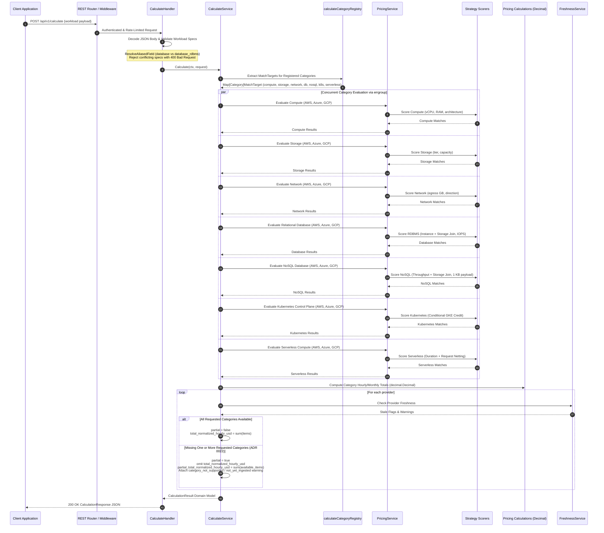
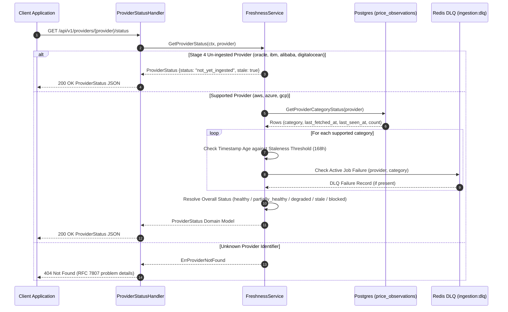
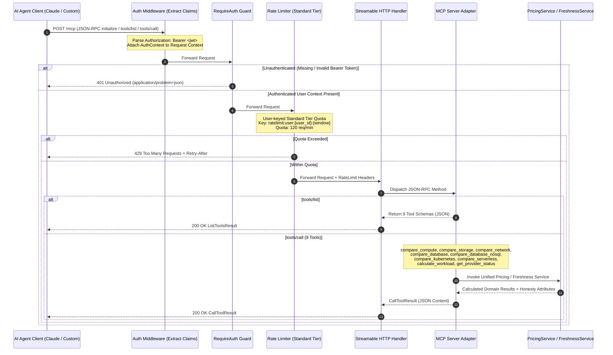

# Calculator Request Lifecycle

This document describes the request lifecycles for single-category pricing lookups, composite multi-service workload calculations, and provider health/freshness checks.

---

## 1. Single-Category Pricing Lifecycle (Cache-Miss Flow)

The following diagram illustrates a request to `GET /api/v1/prices/{category}` across all seven supported categories (`compute`, `storage`, `network`, `database`, `database-nosql`, `kubernetes`, `serverless`) when the requested pricing slice is not present in the Redis cache.

```mermaid
sequenceDiagram
    autonumber
    participant Client as Client (Browser / CLI / Agent)
    participant CORS as CORS Middleware
    participant AuthMW as Auth Middleware
    participant RateLimit as 4-Step Tiered Rate Limiter
    participant Handler as REST Pricing Handler
    participant Svc as PricingService
    participant Cache as Redis Cache
    participant SF as singleflight.Group
    participant DB as Postgres (price_observations)
    participant Match as Matching Engine (CategoryScorer)
    participant Fresh as FreshnessService

    Client->>CORS: GET /api/v1/prices/{category}?params...
    Note over CORS: Check Origin against AllowedOrigins<br/>Set Vary: Origin & Allow-Credentials (if matched)
    
    CORS->>AuthMW: Forward Request
    Note over AuthMW: Parse Authorization: Bearer <jwt><br/>Attach UserClaims to Context (if valid)
    
    AuthMW->>RateLimit: Forward Request
    Note over RateLimit: 1. Evaluate Blunt IP Ceiling (60 req/min)<br/>2. If User -> Standard Tier (120 req/min)<br/>3. Else if cv_anon_id -> Free Tier (20 req/min)<br/>4. Else -> IP Free Tier (20 req/min) & mint cookie
    
    RateLimit->>Handler: Forward Request within rate limit
    Handler->>Handler: Parse & Validate Query Parameters
    Handler->>Svc: GetPrices(ctx, filter)
    
    %% Cache lookup
    Svc->>Cache: GET v1:{provider}:{category}:{region}
    
    alt Cache Hit
        Cache-->>Svc: Cached Observation Slice (JSON)
    else Cache Miss
        Cache-->>Svc: nil (Key Miss / Expired TTL)
        Svc->>SF: DoChan(cache_key, queryFn)
        
        critical Singleflight DB Query Collapse
            SF->>DB: GetNormalizedPricesByProviderCategoryRegion(provider, category, region)
            DB-->>SF: []price_observations rows
            SF->>Cache: SETEX v1:{provider}:{category}:{region} (TTL 5-15 min)
            SF-->>Svc: Normalized Observations
        end
    end
    
    %% Scoring and Matching
    Svc->>Match: MatchObservations(requested_specs, observations)
    Note over Match: Category-specific Strategy Scorer<br/>Assign match_quality (exact / close / approximate)<br/>Elastic categories (storage, network) match qualitative specs;<br/>volume applies as cost multiplier in pricing arithmetic.<br/>Dynamic join for DB & NoSQL candidates
    Match-->>Svc: Matched Price Result
    
    %% Freshness Evaluation
    Svc->>Fresh: IsStale(provider, category, fetched_at)
    Fresh-->>Svc: is_stale boolean
    
    Svc-->>Handler: Domain Pricing Response
    Handler-->>Client: 200 OK JSON Response + X-RateLimit-* Headers
```

---

## 2. Composite Calculation Lifecycle (`POST /api/v1/calculate`)

The following diagram illustrates the composite workload calculation lifecycle across all seven categories via the `calculateCategoryRegistry` (ADR 0031), supporting request alias conflict detection (ADR 0032) and enforcing the ADR 0022 Honesty Contract.



---

## 3. Provider Status & Freshness Lifecycle (`GET /api/v1/providers/{provider}/status`)

The following diagram illustrates provider operational health and data freshness inspection.



---

## 4. Model Context Protocol (MCP) Streamable HTTP Lifecycle (`/mcp`)

The following diagram illustrates how AI agent clients connect, authenticate, discover tools, and invoke comparison operations over Streamable HTTP transport across all nine registered MCP tools.



---

## 5. Key Architectural Invariants

1. **Stampede Protection**: All database fallbacks on cache misses pass through `singleflight.Group.DoChan` using `context.WithoutCancel` so client cancellations do not abort in-flight database population.
2. **Honesty Contract**: Incomplete provider comparisons set `partial: true`, omit `total_normalized_hourly_usd`, and provide `partial_total_normalized_hourly_usd` to prevent false ranking victories (ADR 0022).
3. **Decimal Arithmetic**: All pricing sums, conversions, and breakdowns strictly use `decimal.Decimal` to eliminate floating-point rounding errors (ADR 0015).
4. **Stateless Tiered Rate Limiting**: The 4-step rate limiter executes before pricing arithmetic, protecting backend database compute and Redis memory (ADR 0009).
5. **Strict MCP Authentication**: MCP tool access requires a valid JWT Bearer token and enforces the 120 req/min Standard Tier quota keyed by `user_id`.
6. **Extensible Registries**: Category serialization, calculate dispatch, and pricing arithmetic use strategy registries, eliminating monolithic switch blocks (ADR 0031).
7. **Alias Conflict Resolution**: Conflicting specifications between alias and canonical request parameters are rejected with HTTP 400 (ADR 0032).
