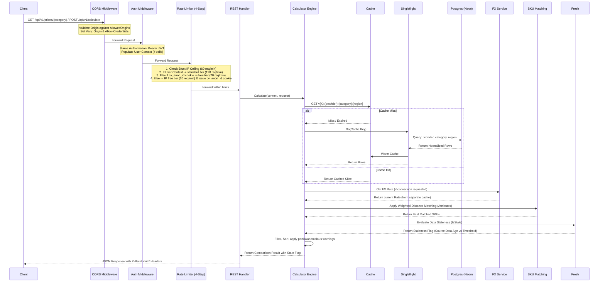
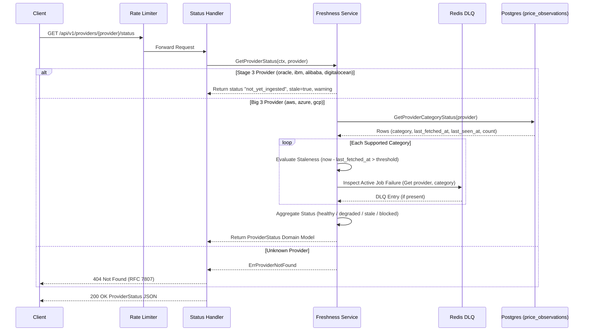

# Calculator Request Lifecycle

This document describes the request lifecycle for pricing and calculation endpoints.

## Request Sequence Diagram

```mermaid
sequenceDiagram
    participant Client
    participant CORS as CORS Middleware
    participant AuthMW as Auth Middleware
    participant RateLimit as Rate Limiter (4-Step)
    participant HTTP as REST Handler
    participant Calc as Calculator Engine
    participant Redis as Cache
    participant SF as Singleflight
    participant DB as Postgres (Neon)
    participant FX as FX Service
    participant Match as SKU Matching

    Client->>CORS: GET /api/v1/prices/{category} / POST /api/v1/calculate
    Note over CORS: Validate Origin against AllowedOrigins<br/>Set Vary: Origin & Allow-Credentials
    
    CORS->>AuthMW: Forward Request
    Note over AuthMW: Parse Authorization: Bearer JWT<br/>Populate User Context (if valid)
    
    AuthMW->>RateLimit: Forward Request
    Note over RateLimit: 1. Check Blunt IP Ceiling (60 req/min)<br/>2. If User Context -> standard tier (120 req/min)<br/>3. Else if cv_anon_id cookie -> free tier (20 req/min)<br/>4. Else -> IP free tier (20 req/min) & issue cv_anon_id cookie
    
    RateLimit->>HTTP: Forward within limits
    HTTP->>Calc: Calculate(context, request)
    
    %% Caching and DB Access
    Calc->>Redis: GET v{X}:{provider}:{category}:{region}
    
    alt Cache Miss
        Redis-->>Calc: Miss / Expired
        Calc->>SF: Do(Cache Key)
        SF->>DB: Query: provider, category, region
        DB-->>SF: Return Normalized Rows
        SF->>Redis: Warm Cache
        SF-->>Calc: Return Rows
    else Cache Hit
        Redis-->>Calc: Return Cached Slice
    end

    %% Processing
    Calc->>FX: Get FX Rate (if conversion requested)
    FX-->>Calc: Return current Rate (from separate cache)
    
    Calc->>Match: Apply Weighted-Distance Matching (Attributes)
    Match-->>Calc: Return Best Matched SKUs
    
    Calc->>Fresh: Evaluate Data Staleness (IsStale)
    Fresh-->>Calc: Return Staleness Flag (Source Data Age vs Threshold)

    Calc->>Calc: Filter, Sort, apply partial/anomalous warnings
    
    Calc-->>HTTP: Return Comparison Result with Stale Flag
    HTTP-->>Client: JSON Response with X-RateLimit-* Headers
```

## Provider Status & Freshness Sequence Diagram

```mermaid
sequenceDiagram
    participant Client
    participant RateLimit as Rate Limiter
    participant StatusH as Status Handler
    participant Fresh as Freshness Service
    participant DLQ as Redis DLQ
    participant DB as Postgres (price_observations)

    Client->>RateLimit: GET /api/v1/providers/{provider}/status
    RateLimit->>StatusH: Forward Request
    StatusH->>Fresh: GetProviderStatus(ctx, provider)

    alt Stage 3 Provider (oracle, ibm, alibaba, digitalocean)
        Fresh-->>StatusH: Return status "not_yet_ingested", stale=true, warning
    else Big 3 Provider (aws, azure, gcp)
        Fresh->>DB: GetProviderCategoryStatus(provider)
        DB-->>Fresh: Rows (category, last_fetched_at, last_seen_at, count)
        
        loop Each Supported Category
            Fresh->>Fresh: Evaluate Staleness (now - last_fetched_at > threshold)
            Fresh->>DLQ: Inspect Active Job Failure (Get provider, category)
            DLQ-->>Fresh: DLQ Entry (if present)
        end

        Fresh->>Fresh: Aggregate Status (healthy / degraded / stale / blocked)
        Fresh-->>StatusH: Return ProviderStatus Domain Model
    else Unknown Provider
        Fresh-->>StatusH: ErrProviderNotFound
        StatusH-->>Client: 404 Not Found (RFC 7807)
    end

    StatusH-->>Client: 200 OK ProviderStatus JSON
```

