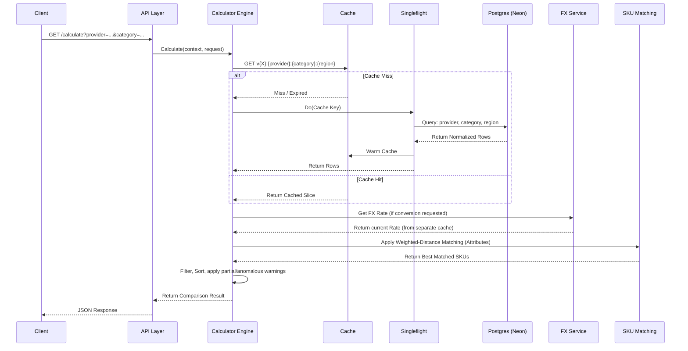

# Calculator Request Lifecycle

```mermaid
sequenceDiagram
    participant Client
    participant HTTP as API Layer
    participant Calc as Calculator Engine
    participant Redis as Cache
    participant SF as Singleflight
    participant DB as Postgres (Neon)
    participant FX as FX Service
    participant Match as SKU Matching

    Client->>HTTP: GET /calculate?provider=...&category=...
    HTTP->>Calc: Calculate(context, request)
    
    %% Caching and DB Access
    Calc->>Redis: GET v{X}:{provider}:{category}:{region}
    
    alt Cache Miss
        Redis-->>Calc: Miss / Expired
        Calc->>SF: Do(Cache Key)
        SF->>DB: Query: provider, category, region
        DB-->>SF: Return Normalized Rows
        SF->>Redis: Warm Cache
        SF-->>Calc: Return Rows
    else Cache Hit
        Redis-->>Calc: Return Cached Slice
    end

    %% Processing
    Calc->>FX: Get FX Rate (if conversion requested)
    FX-->>Calc: Return current Rate (from separate cache)
    
    Calc->>Match: Apply Weighted-Distance Matching (Attributes)
    Match-->>Calc: Return Best Matched SKUs
    
    Calc->>Calc: Filter, Sort, apply partial/anomalous warnings
    
    Calc-->>HTTP: Return Comparison Result
    HTTP-->>Client: JSON Response
```
