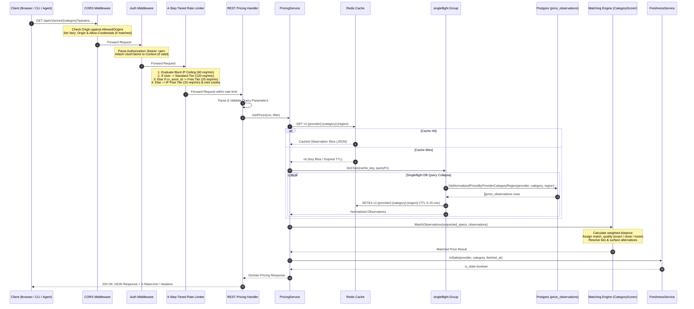
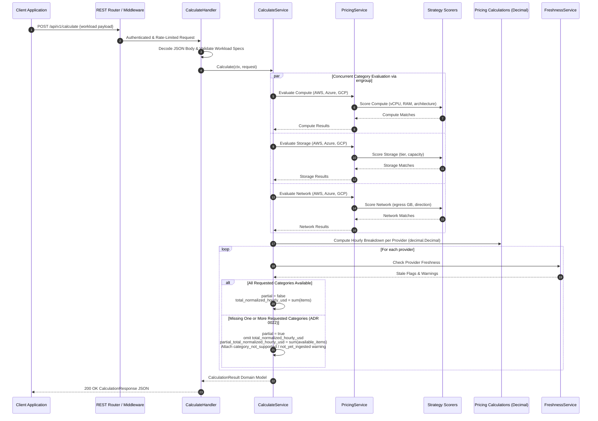
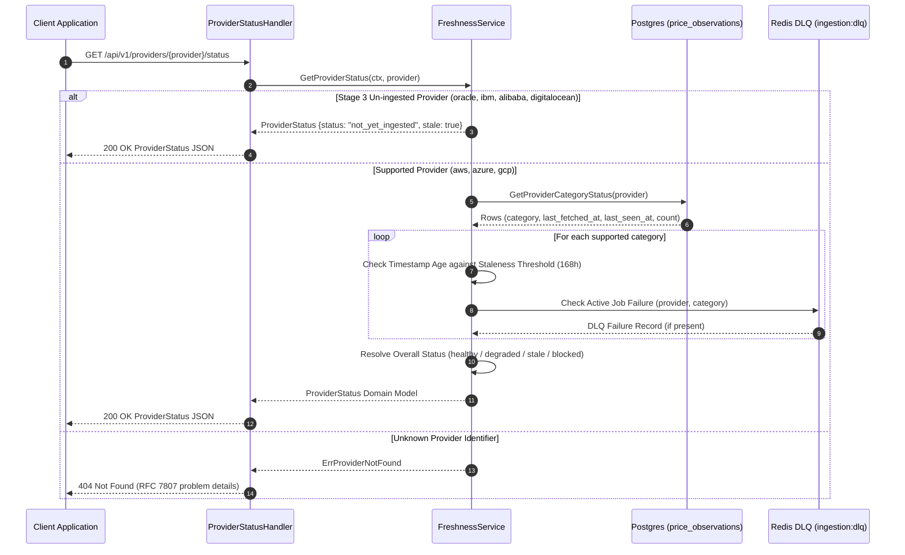

# Calculator Request Lifecycle

This document describes the request lifecycles for single-category pricing lookups, composite multi-service workload calculations, and provider health/freshness checks.

---

## 1. Single-Category Pricing Lifecycle (Cache-Miss Flow)

The following diagram illustrates a request to `GET /api/v1/prices/{category}` (e.g., compute, storage, network) when the requested pricing slice is not present in the Redis cache.

---

## 2. Composite Calculation Lifecycle (`POST /api/v1/calculate`)

The following diagram illustrates the composite workload calculation lifecycle across multiple providers and categories, enforcing the ADR 0022 Honesty Contract.

---

## 3. Provider Status & Freshness Lifecycle (`GET /api/v1/providers/{provider}/status`)

The following diagram illustrates provider operational health and data freshness inspection.

---

## 4. Key Architectural Invariants

1. **Stampede Protection**: All database fallbacks on cache misses pass through `singleflight.Group.DoChan` using `context.WithoutCancel` so client cancellations do not abort in-flight database population.
2. **Honesty Contract**: Incomplete provider comparisons set `partial: true`, omit `total_normalized_hourly_usd`, and provide `partial_total_normalized_hourly_usd` to prevent false ranking victories.
3. **Decimal Arithmetic**: All pricing sums, conversions, and breakdowns strictly use `decimal.Decimal` to eliminate floating-point rounding errors.
4. **Stateless Tiered Rate Limiting**: The 4-step rate limiter executes before pricing arithmetic, protecting backend database compute and Redis memory.
