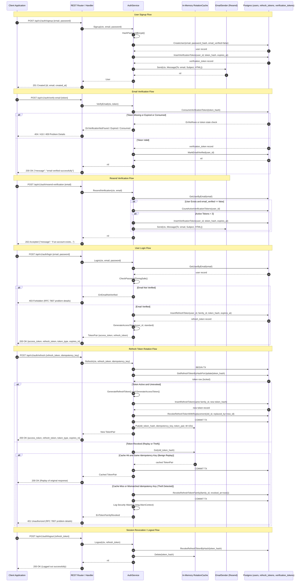

# Auth Token Rotation and Theft Containment

This document describes the authentication token rotation lifecycle, idempotency replay containment, and logout flow.

## 1. Sequence Diagram

## 2. Security Invariants

1. **Idempotency Protection:**
   The `POST /api/v1/auth/refresh` endpoint requires both `refresh_token` and `idempotency_key`. A thread-safe in-memory cache stores rotated token pairs for 10 seconds. Network retries that transmit the identical `idempotency_key` receive the cached token pair without creating new database records.

2. **Theft Containment:**
   If a client presents a revoked refresh token with a different `idempotency_key`, or after the 10-second replay window, the system flags the request as token theft. The system immediately executes an $O(1)$ query that revokes all active tokens in that `family_id` and writes a security log.

3. **Concurrency Safety:**
   Rotation uses `SELECT ... FOR UPDATE` row-level database locking inside an isolated transaction. Concurrent requests with identical tokens wait on the lock and then evaluate against the replay cache safely.

4. **Email Verification Gate and Enumeration Suppression:**
   Accounts created through `POST /api/v1/auth/signup` persist with `email_verified = false`. Login attempts for unverified accounts receive `403 Forbidden` with problem detail type `https://cloudvitta.dev/errors/email-not-verified`. The resend endpoint `POST /api/v1/auth/resend-verification` enforces a maximum of 3 active verification tokens and uniformly returns `202 Accepted` to prevent user email enumeration.
