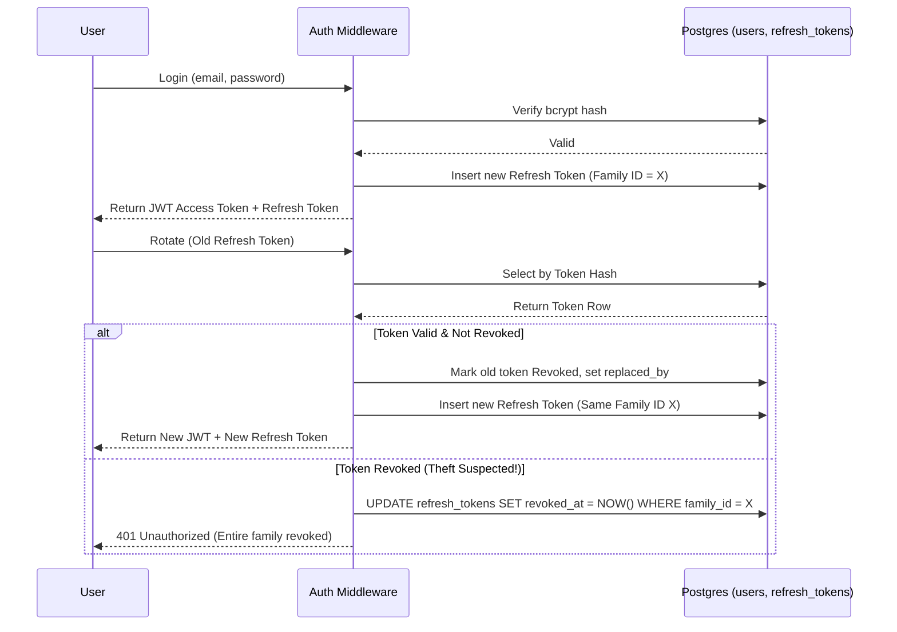

# Auth Token Rotation (Family Theft Containment)

```mermaid
sequenceDiagram
    participant User
    participant AuthMW as Auth Middleware
    participant DB as Postgres (users, refresh_tokens)

    %% Login
    User->>AuthMW: Login (email, password)
    AuthMW->>DB: Verify bcrypt hash
    DB-->>AuthMW: Valid
    AuthMW->>DB: Insert new Refresh Token (Family ID = X)
    AuthMW-->>User: Return JWT Access Token + Refresh Token

    %% Rotation
    User->>AuthMW: Rotate (Old Refresh Token)
    AuthMW->>DB: Select by Token Hash
    DB-->>AuthMW: Return Token Row
    
    alt Token Valid & Not Revoked
        AuthMW->>DB: Mark old token Revoked, set replaced_by
        AuthMW->>DB: Insert new Refresh Token (Same Family ID X)
        AuthMW-->>User: Return New JWT + New Refresh Token
    else Token Revoked (Theft Suspected!)
        AuthMW->>DB: UPDATE refresh_tokens SET revoked_at = NOW() WHERE family_id = X
        AuthMW-->>User: 401 Unauthorized (Entire family revoked)
    end
```
