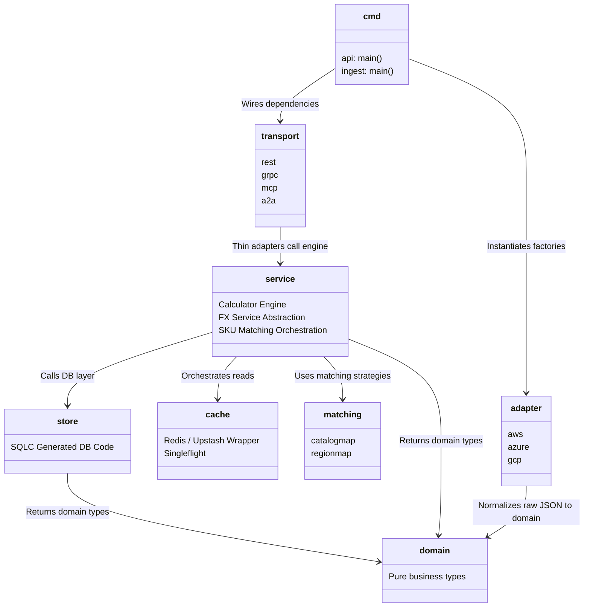

# Package Structure & Dependencies

```mermaid
classDiagram
    class cmd {
        api: main()
        ingest: main()
    }
    
    class transport {
        rest
        grpc
        mcp
        a2a
    }

    class service {
        Calculator Engine
        FX Service Abstraction
        SKU Matching Orchestration
    }

    class domain {
        Pure business types
    }

    class adapter {
        aws
        azure
        gcp
    }

    class store {
        SQLC Generated DB Code
    }

    class cache {
        Redis / Upstash Wrapper
        Singleflight
    }

    class matching {
        catalogmap
        regionmap
    }

    cmd --> transport : Wires dependencies
    cmd --> adapter : Instantiates factories
    
    transport --> service : Thin adapters call engine
    
    service --> store : Calls DB layer
    service --> cache : Orchestrates reads
    service --> matching : Uses matching strategies
    service --> domain : Returns domain types
    
    adapter --> domain : Normalizes raw JSON to domain
    
    store --> domain : Returns domain types
```
