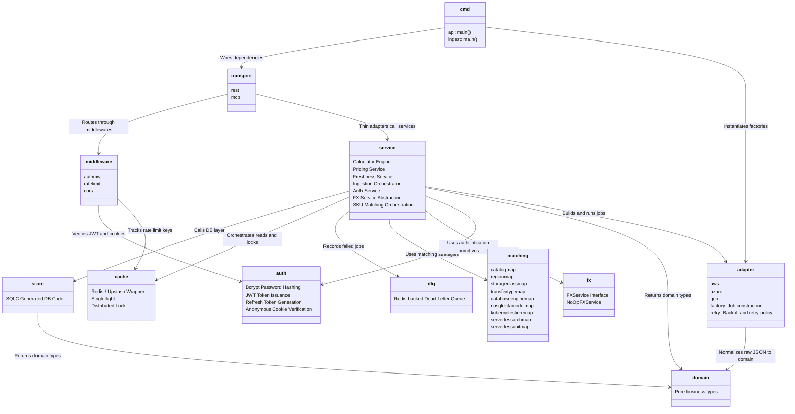

# Package Structure & Dependencies

```mermaid
classDiagram
    class cmd {
        api: main()
        ingest: main()
    }
    
    class transport {
        rest
        mcp
    }

    class middleware {
        authmw
        ratelimit
        cors
    }

    class service {
        Calculator Engine
        Pricing Service
        Freshness Service
        Ingestion Orchestrator
        Auth Service
        FX Service Abstraction
        SKU Matching Orchestration
    }

    class domain {
        Pure business types
    }

    class adapter {
        aws
        azure
        gcp
        factory: Job construction
        retry: Backoff and retry policy
    }

    class store {
        SQLC Generated DB Code
    }

    class cache {
        Redis / Upstash Wrapper
        Singleflight
        Distributed Lock
    }

    class dlq {
        Redis-backed Dead Letter Queue
    }

    class matching {
        catalogmap
        regionmap
        storageclassmap
        transfertypemap
        databaseenginemap
        nosqldatamodelmap
        kubernetestieremap
        serverlessarchmap
        serverlessunitmap
    }

    class fx {
        FXService Interface
        NoOpFXService
    }

    class auth {
        Bcrypt Password Hashing
        JWT Token Issuance
        Refresh Token Generation
        Anonymous Cookie Verification
    }

    cmd --> transport : Wires dependencies
    cmd --> adapter : Instantiates factories
    
    transport --> middleware : Routes through middlewares
    middleware --> auth : Verifies JWT and cookies
    middleware --> cache : Tracks rate limit keys
    
    transport --> service : Thin adapters call services
    
    service --> store : Calls DB layer
    service --> cache : Orchestrates reads and locks
    service --> dlq : Records failed jobs
    service --> matching : Uses matching strategies
    service --> fx : Uses currency conversion
    service --> auth : Uses authentication primitives
    service --> domain : Returns domain types
    service --> adapter : Builds and runs jobs
    
    adapter --> domain : Normalizes raw JSON to domain
    
    store --> domain : Returns domain types
```

